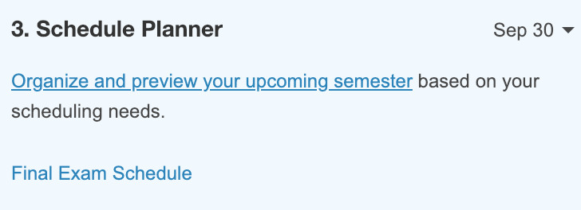
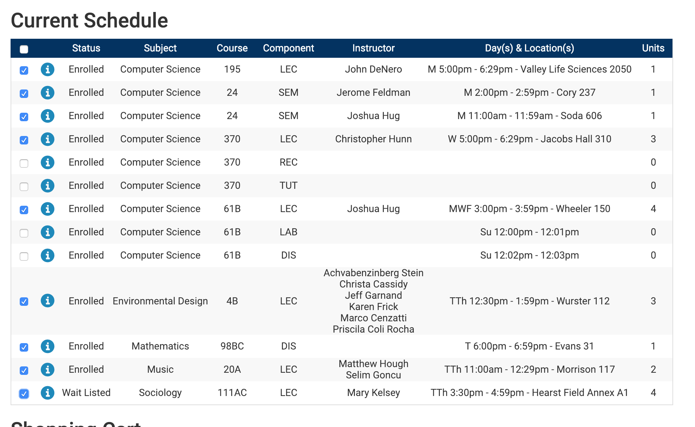
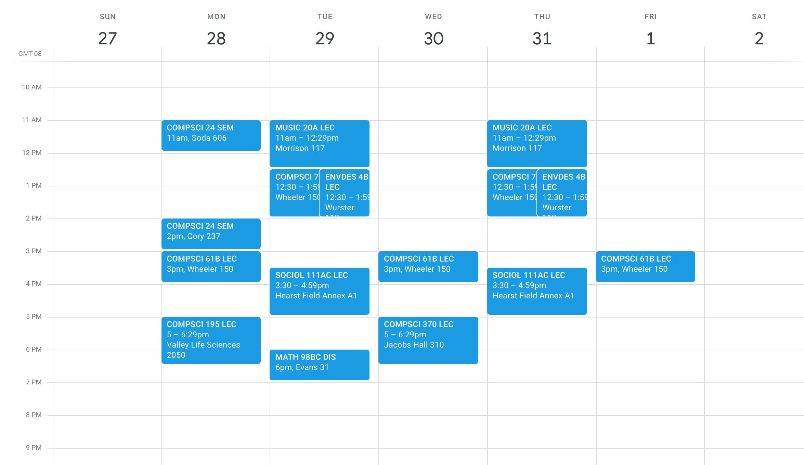

This project is directly forked from https://github.com/ziyaointl/Schedule-Exporter, with a few minor changes so that it can be ported to Firefox. Furthermore, the end date option is used so that the schedules is contained withing the time period of the semester and the description is the title of the course. Massive credit once again to xiyaointl, as 99% of the code is not touched. Much of the readme document below isn't touched either, and the only part edited is the installation instructions.

## Berkeley Schedule Exporter

Export your Berkeley class schedule to .ics! (which can be imported to Google Calendar). Should also work with other schools that use collegescheduler.com.

Note: This is not a novel idea and a number of people have done something similar before (e.g. [here](https://github.com/thisiscam/calcentral-schedule-to-ical) and [here](https://github.com/PranayJuneCS/CalScheduler)). However, none of them seem to work as of Jan 17 2019, so I wrote my own.

### Installation

Download the .xpi file from the web-ext-artifact folder. From the about:addons page on Firefox, click the settings button on the page to install addon from file. Select the file to install. 

### Usage

1. Go to CalCentral, My Academics. Select Organize and preview your upcoming semester.

   

2. Check the courses you want to export. You can select from both Current Schedule and Shopping Cart.

      

3. Click on the extension icon in the upper right Chrome menu. (You might have to wait a few seconds for the page to fully load before clicking on the icon). You should get a file named calendar.ics. Then, you can import this ics file to whatever calendar platform you desire. Classes automatically repeat weekly starting from the first day of the current semester!

      

### Contributing

Feel free to report/fix any bugs, improve the documentation, or add new features to this extension. Good things to work on include a user interface and better error handling. Simply open a new issue or a new pull request to get started!
